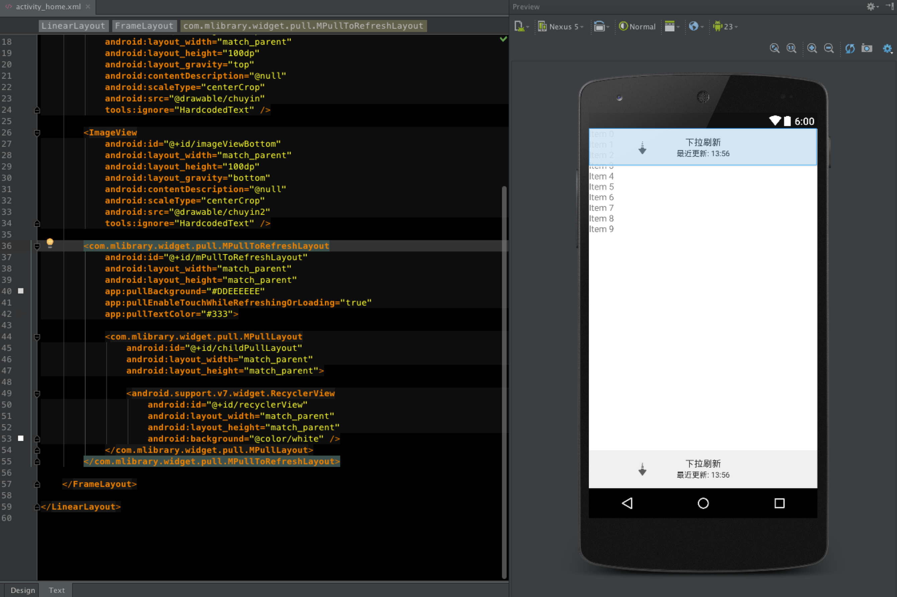
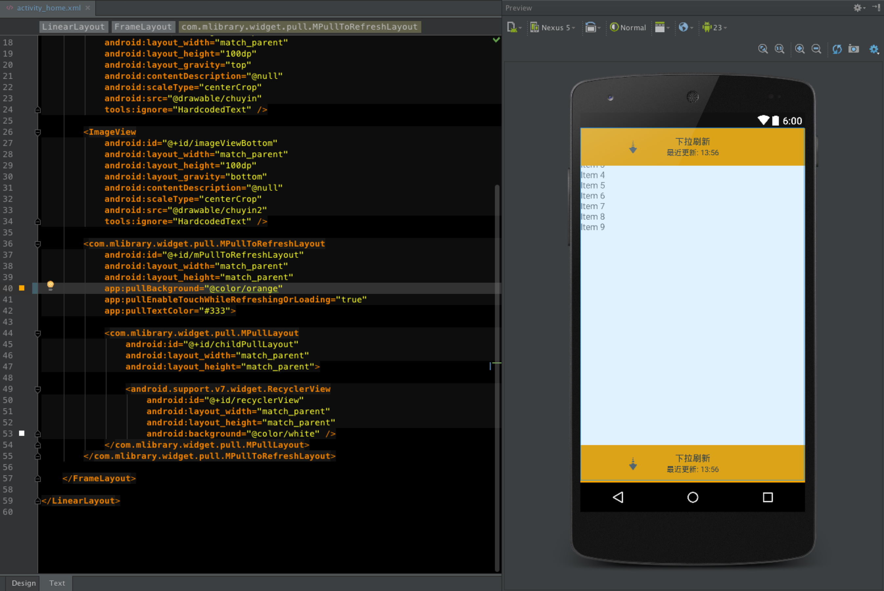
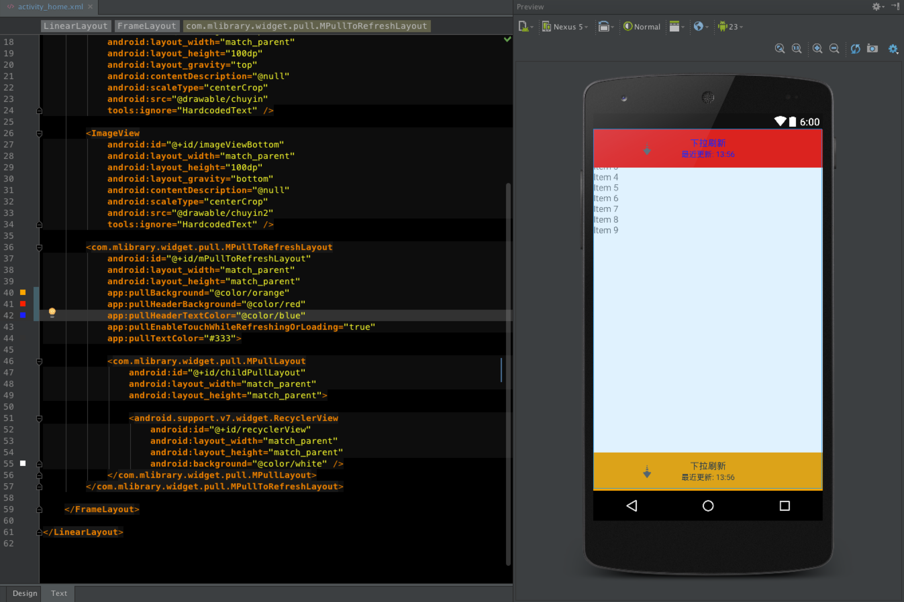

# MPullLib

this library is based on [https://github.com/wcy10586/OverscrollLayout](https://github.com/wcy10586/OverscrollLayout)

thanks for [@wcy10586](https://github.com/wcy10586)

### fectures

1. In theory is applicable to all android views.(I only used in RecyclerView, others had not tried.)
2. Good compatibility for [Drag and Swipe with RecyclerView](https://medium.com/@ipaulpro/drag-and-swipe-with-recyclerview-b9456d2b1aaf#.59itwdxpk).
3. Support multi-fingers to pull to refresh
4. Can only use **com.mlibrary.widget.pull.MPullLayout** to realize overscroll.
5. And add **com.mlibrary.widget.pull.MPullToRefreshLayout**(child must be **MPullLayout**) to realize pull to refresh.

### preview the result gif


### preview in android studio while edit the layout xml





### add to dependencies

```
	compile 'com.mlibrary:mpulllib:0.1'
```

### use in xml
```
<LinearLayout xmlns:android="http://schemas.android.com/apk/res/android"
    xmlns:app="http://schemas.android.com/apk/res-auto"
    xmlns:tools="http://schemas.android.com/tools"
    android:layout_width="match_parent"
    android:layout_height="match_parent"
    android:background="#eeeeee"
    android:orientation="vertical">

    <FrameLayout
        android:layout_width="match_parent"
        android:layout_height="0dp"
        android:layout_weight="1"
        android:background="#83B7D5"
        tools:ignore="NestedWeights">

        <ImageView
            android:id="@+id/imageViewTop"
            android:layout_width="match_parent"
            android:layout_height="100dp"
            android:layout_gravity="top"
            android:contentDescription="@null"
            android:scaleType="centerCrop"
            android:src="@drawable/chuyin"
            tools:ignore="HardcodedText" />

        <ImageView
            android:id="@+id/imageViewBottom"
            android:layout_width="match_parent"
            android:layout_height="100dp"
            android:layout_gravity="bottom"
            android:contentDescription="@null"
            android:scaleType="centerCrop"
            android:src="@drawable/chuyin2"
            tools:ignore="HardcodedText" />

        <com.mlibrary.widget.pull.MPullToRefreshLayout
            android:id="@+id/mPullToRefreshLayout"
            android:layout_width="match_parent"
            android:layout_height="match_parent"
            app:pullBackground="@color/orange"
            app:pullHeaderBackground="@color/red"
            app:pullHeaderTextColor="@color/blue"
            app:pullEnableTouchWhileRefreshingOrLoading="true"
            app:pullTextColor="#333">

            <com.mlibrary.widget.pull.MPullLayout
                android:id="@+id/childPullLayout"
                android:layout_width="match_parent"
                android:layout_height="match_parent">

                <android.support.v7.widget.RecyclerView
                    android:id="@+id/recyclerView"
                    android:layout_width="match_parent"
                    android:layout_height="match_parent"
                    android:background="@color/white" />
            </com.mlibrary.widget.pull.MPullLayout>
        </com.mlibrary.widget.pull.MPullToRefreshLayout>

    </FrameLayout>

</LinearLayout>

```
### use in java

###### 1. set global duration


```
	MPullToRefreshLayout.setGlobalDurationFooterToLoading(3000);
	MPullToRefreshLayout.setGlobalDurationFooterToNormal(3000);          
	MPullToRefreshLayout.setGlobalDurationHeaderToNormal(2000);
	MPullToRefreshLayout.setGlobalDurationHeaderToRefreshing(2000);
```

###### 1.1 override global duartion

```
    mPullLayout.setDurationFooterToLoading(2000);
    mPullLayout.setDurationFooterToNormal(2000);
    mPullLayout.setDurationHeaderToNormal(2000);
    mPullLayout.setDurationHeaderToRefreshing(2000);
```


###### 2. set debugable to see console

```
	mPullLayout.setDebugAble(true);//debug
```

###### 3. example for *setOnPullRefreshListener*

```
	mPullLayout.setOnPullRefreshListener(new OnPullRefreshListener() {
            @Override
            public void onRefresh() {
                currentPage = 0;
                doAsyncRequest(true);
            }

            @Override
            public void onLoadMore() {
                doAsyncRequest(false);
            }
        });
```

###### 4. example for *setOnOverScrollListener*

```
	mPullLayout.setOnOverScrollListener(new OnOverScrollListener() {
            @Override
            public void onOverScroll(int currentX, int currentY, boolean isInDrag) {
                Log.d(TAG, "currentY:" + currentY);
                if (topImageViewHeight == 0) {
                    topImageViewHeight = imageViewTop.getMeasuredHeight();
                }
                if (bottomImageViewHeight == 0) {
                    bottomImageViewHeight = imageViewBottom.getMeasuredHeight();
                }
                ViewGroup.LayoutParams topLayoutParams = imageViewTop.getLayoutParams();
                ViewGroup.LayoutParams bottomLayoutParams = imageViewBottom.getLayoutParams();

                int absY = Math.abs(currentY);

                if (currentY < 0) {
                    topLayoutParams.height = absY > topImageViewHeight ? absY : topImageViewHeight;
                    imageViewTop.setLayoutParams(topLayoutParams);
                } else {
                    bottomLayoutParams.height = absY > bottomImageViewHeight ? absY : bottomImageViewHeight;
                    imageViewBottom.setLayoutParams(bottomLayoutParams);
                }
            }
        });
```

###### 5. example for *async request*

```
	private int currentPage = 0;
    private static int totalPage = 8;

    public void doAsyncRequest(final boolean isRefreshNotLoading) {
        new Handler().postDelayed(
                new Runnable() {
                    @Override
                    public void run() {
                        currentPage = currentPage + 1;//设置当前currentPage
                        if (isRefreshNotLoading) {//下拉刷新,清空原有数据
                            mRecyclerViewAdapter.removeAll();
                            mPullLayout.completeHeaderRefreshSuccess();
                        } else {//加载更多
                            if (currentPage >= totalPage) {
                                if (mPullLayout != null)
                                    mPullLayout.completeFooterLoadNoMoreData();
                            } else {
                                if (mPullLayout != null)
                                    mPullLayout.completeFooterLoadSuccess();
                            }
                        }
                        List<ItemEntity> tmpDataList = new ArrayList<>();
                        for (int i = 0; i < 20; i++)
                            tmpDataList.add(new ItemEntity(null, MTestUtil.getRandomTransparentAvatar(), mRecyclerViewAdapter.getDataList().size() + i));
                        mRecyclerViewAdapter.add(tmpDataList);

                        if (mRecyclerViewAdapter.getDataList().isEmpty())
                            mPullLayout.completeFooterLoadNoMoreData();
                        else if (currentPage < totalPage)
                            mPullLayout.resetFooterView();

                    }
                }, 3000);
    }
```
